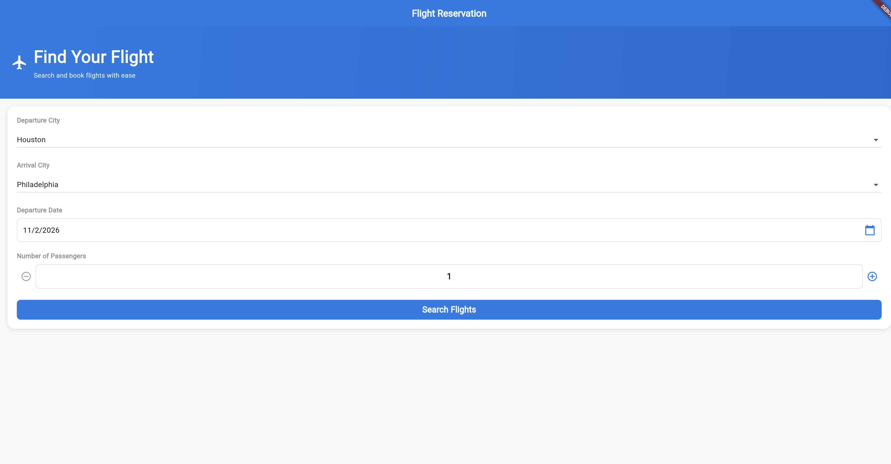
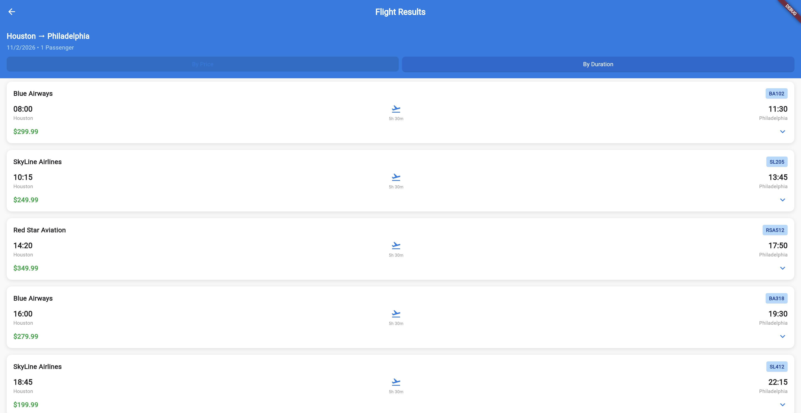

# SkyBooker ✈️

**Your Personal Flight Booking Companion**

SkyBooker is a modern, intuitive Flutter application that simplifies the flight booking experience. Search for flights, compare prices, and book your next journey with ease - all from a beautifully designed mobile interface.

---

## 🌟 Features

- **Smart Flight Search**: Find flights by departure/arrival cities and travel dates
- **Price Comparison**: Sort flights by price or duration to find the best option
- **Detailed Flight Information**: View aircraft type, seat specifications, and meal services
- **Multi-Passenger Booking**: Book for up to 9 passengers with individual details
- **Clean, Modern UI**: Material Design 3 interface with smooth animations
- **Responsive Design**: Works seamlessly across different screen sizes

---

## 📱 Screenshots

<p align="center">
  
  
</p>

---

## 🏗️ Architecture & Code Quality

This project follows **Clean Code** principles with a well-organized structure:

```
lib/
├── common/          # App-wide constants and themes
│   ├── app_strings.dart   # All UI text constants
│   └── app_theme.dart     # Theme colors and styles
├── data/            # Static data and data sources
│   └── flight_data.dart   # Sample flight data
├── models/          # Data models
│   └── flight.dart        # Flight model class
├── screens/         # App screens/pages
│   ├── flight_search.dart
│   ├── flight_list.dart
│   ├── flight_booking.dart
│   └── flight_details.dart
├── utils/           # Utility functions
│   ├── validators.dart    # Form validation utilities
│   └── formatters.dart    # Data formatting utilities
├── widgets/         # Reusable widget components
│   ├── flight_card.dart
│   └── expandable_flight_card.dart
└── main.dart        # App entry point
```

### Key Principles Applied:

✅ **Modular Structure**: Code organized into logical directories  
✅ **No Hardcoding**: All strings and theme values extracted to constants  
✅ **Widget Classes Over Functions**: All custom widgets are proper classes for better performance  
✅ **Separation of Concerns**: Data, UI, and logic properly separated  
✅ **Reusable Components**: Common widgets and utilities extracted for reuse  

---

## 🚀 Getting Started

### Prerequisites

- [Flutter SDK](https://flutter.dev/docs/get-started/install) (3.0 or higher)
- Dart SDK (comes with Flutter)
- An IDE (VS Code, Android Studio, or IntelliJ IDEA)
- Android Emulator or iOS Simulator (or a physical device)

### Installation

1. **Clone the repository**
   ```bash
   git clone https://github.com/your-username/flutterproject.git
   cd flutterproject
   ```

2. **Install dependencies**
   ```bash
   flutter pub get
   ```

3. **Run the app**
   ```bash
   flutter run
   ```

### Building for Production

**Android (APK)**
```bash
flutter build apk --release
```

**Android (App Bundle)**
```bash
flutter build appbundle --release
```

**Web**
```bash
flutter build web
```

---

## 🎯 How to Use

1. **Search for Flights**: Select departure city, arrival city, date, and number of passengers
2. **Browse Results**: View available flights sorted by price or duration
3. **View Details**: Tap on any flight to see detailed information
4. **Book Flight**: Click "Book Now" and fill in passenger details
5. **Confirm**: Review your booking and confirm

---

## 🛠️ Technologies Used

- **Flutter**: UI framework for cross-platform development
- **Dart**: Programming language
- **Material Design 3**: Modern, accessible design system

---

## 📝 Development Notes

This project was developed following academic requirements for:
- Clean code architecture
- Professional code organization
- Proper use of Flutter best practices
- No hardcoded values
- Reusable component design

---

## 🤝 Contributing

While this is primarily an educational project, suggestions and improvements are welcome!

1. Fork the repository
2. Create your feature branch (`git checkout -b feature/AmazingFeature`)
3. Commit your changes (`git commit -m 'Add some AmazingFeature'`)
4. Push to the branch (`git push origin feature/AmazingFeature`)
5. Open a Pull Request

---

## 📄 License

This project is created for educational purposes.

---

## 👤 Author

**Denis Damse**

- GitHub: [@denisdamse](https://github.com/denisdamse) *(replace with your actual username)*

---

## 🙏 Acknowledgments

- Flutter team for the amazing framework
- Material Design team for the design system
- All contributors and supporters

---

**Made with ❤️ and Flutter**
